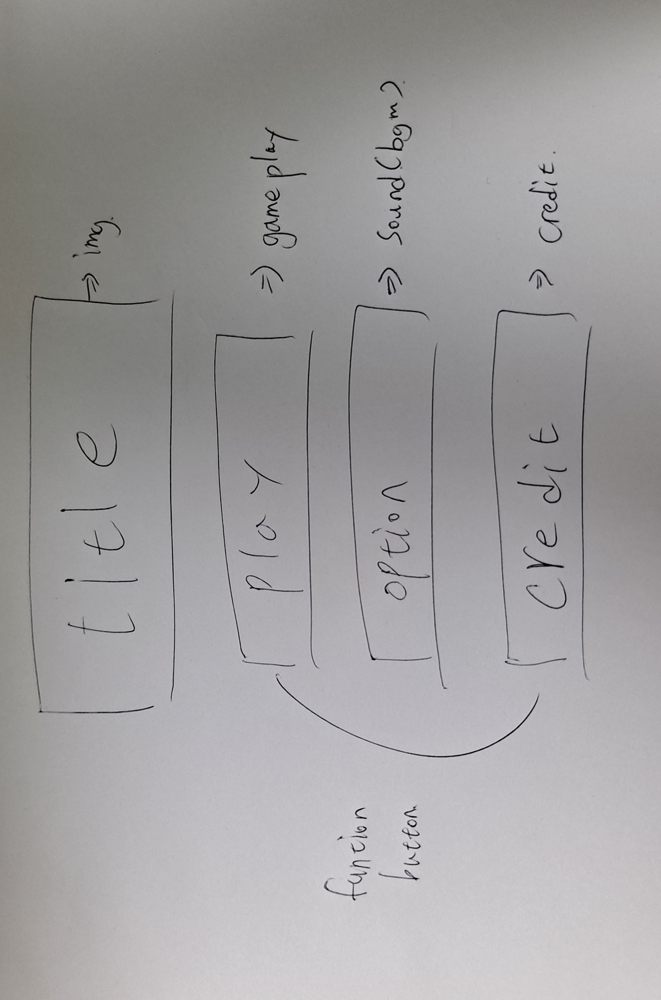
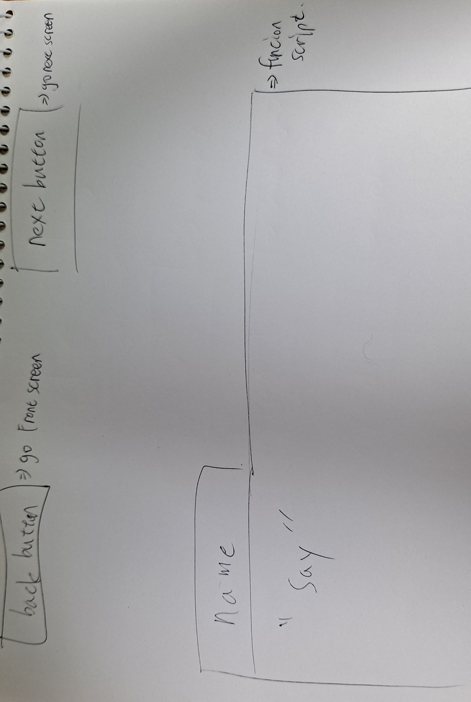
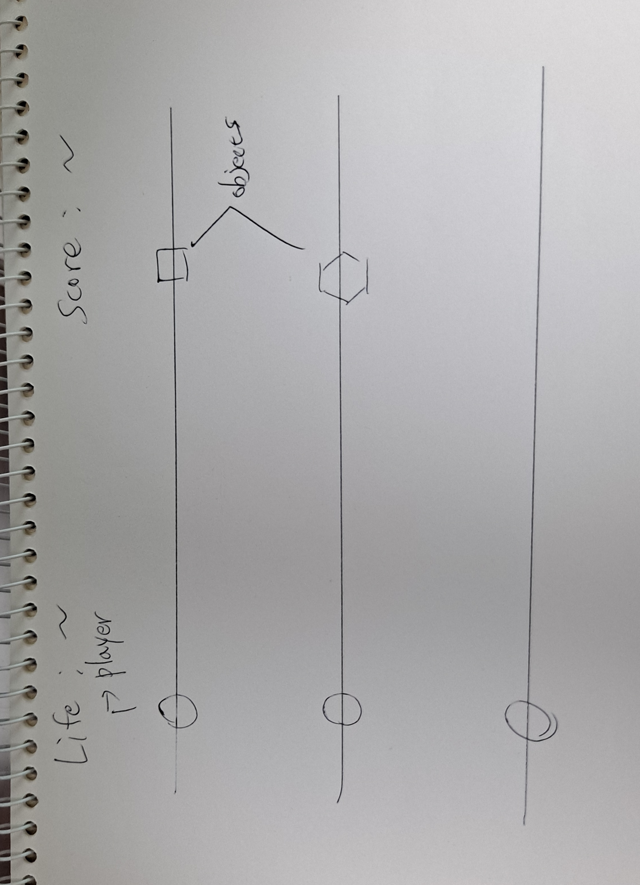
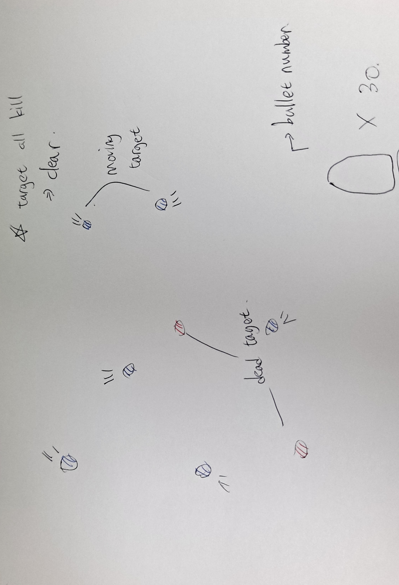
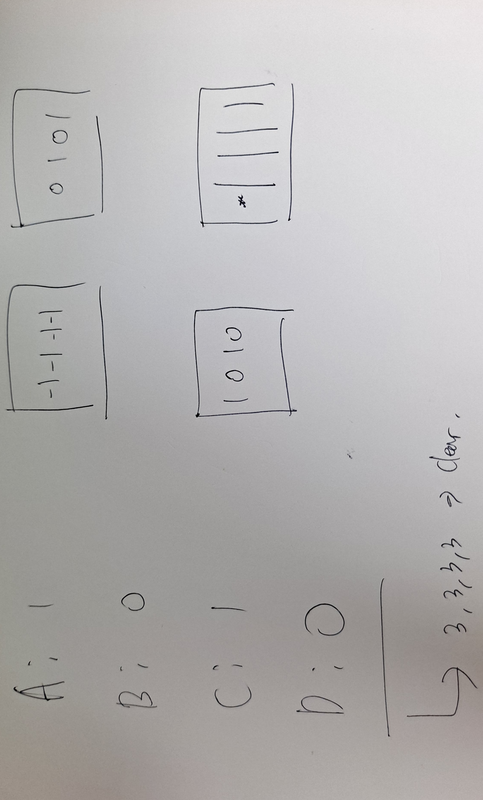

// Name       : junhyeong Kim
// Assignment : make_a_game
// Course     : CS099
// Spring 2021

# High Concept
I will make a game where you can enjoy 'mini-games'.

## Game play
### first game
The first game is a simple dodge game played by pressing the keyboard. 
If it touches an object, it will be damaged.
### second game
The second game is a simple click game. Targets must be removed within a limited number of times.
### last game
The last one is a simple brain game. Make 'A', 'B', 'C', and 'D' all three.

Clear all three games and you're done.

# Theme

## Idea
At first, I was going to make only one game, but I thought it would be nice to make various games.
I wanted to make it as easy as possible and make it easy to play many games in a short time.

# Mock Ups

## MAIN MENU

## Story

## GAME1

## GAME2

## GAME 3
